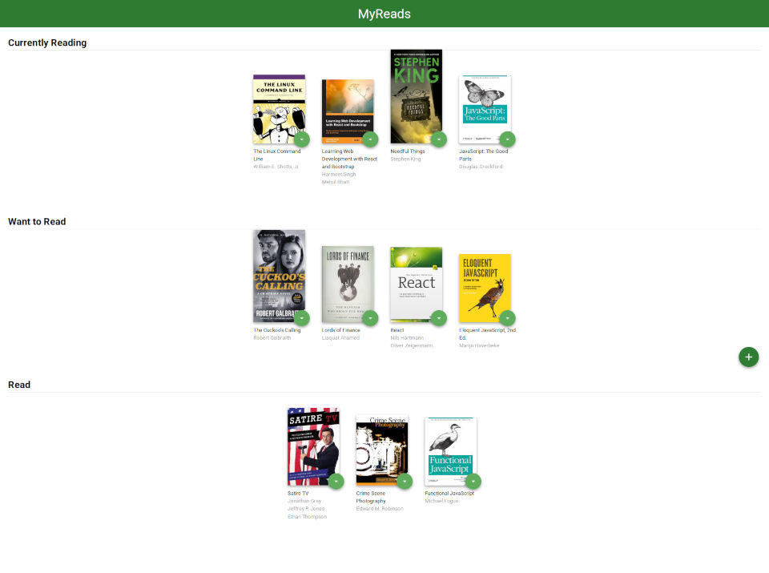
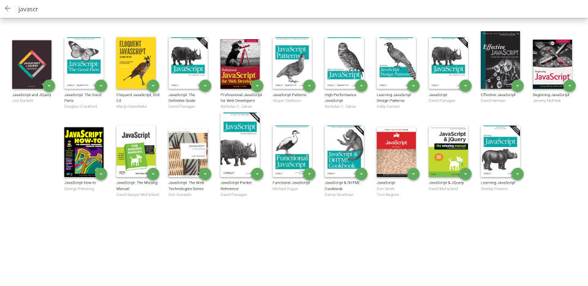

# MyReads

### Description & Motivation

This is project #7 of 8 on Udacity's Front End Nanodegree. Approaching the finish line!

The objective was to practice building a React web application, by writing my own components, passing state and props down from parent to children, and using react-router to manage changing between components and displaying the correct browser URLs.

I thought this project was challenging, without being too hard. As my first React project, the logic of passing state and props down felt confusing at times (React can feel a bit "bureaucratic" at times), but luckily everything I needed to complete this project had been thoroughly covered in the past lessons.

By the end of the project, I feel like React is actually not difficult at all. It just requires a different way of thinking and a new (to me) approach to building a web application. I am excited about it and looking forward to using React on more projects!

### Project Requirements

[See the **rubric** for specific criteria.](https://review.udacity.com/#!/rubrics/918/view)

The main page of the MyReads App displays three bookshelves, "Currently Reading," "Want to Read," and "Read", with books on each shelf. Each book has a control that lets you select the shelf for that book. When you select a different shelf, the book moves there. The default value for the control should always be the current shelf the book is in.

The search page has a text input for searching books. As the value of the text input changes, the books that match that query are displayed on the page, along with a control to add the book to the main library.

When a book is on a bookshelf, it should have the same state on both the main application page and the search page.

### How to run MyReads locally

- Clone this repository: `git clone https://github.com/mairamartinsk/my-reads.git`
- Install all project dependencies with `npm install`
- Start the development server with `npm start`
- Visit [localhost:3000](localhost:3000) on your browser of choice to see the app

### BooksAPI Search Terms

The backend API uses a fixed set of cached search results and is limited to a particular set of search terms, which can be found in [SEARCH_TERMS.md](SEARCH_TERMS.md). That list of terms are the _only_ terms that will work with the backend.

### Tech / Stack:

- [React.js](https://reactjs.org/)
- [react-router-dom](https://www.npmjs.com/package/react-router-dom)
- [prop-types](https://www.npmjs.com/package/prop-types)
- BooksAPI (provided by Udacity)

